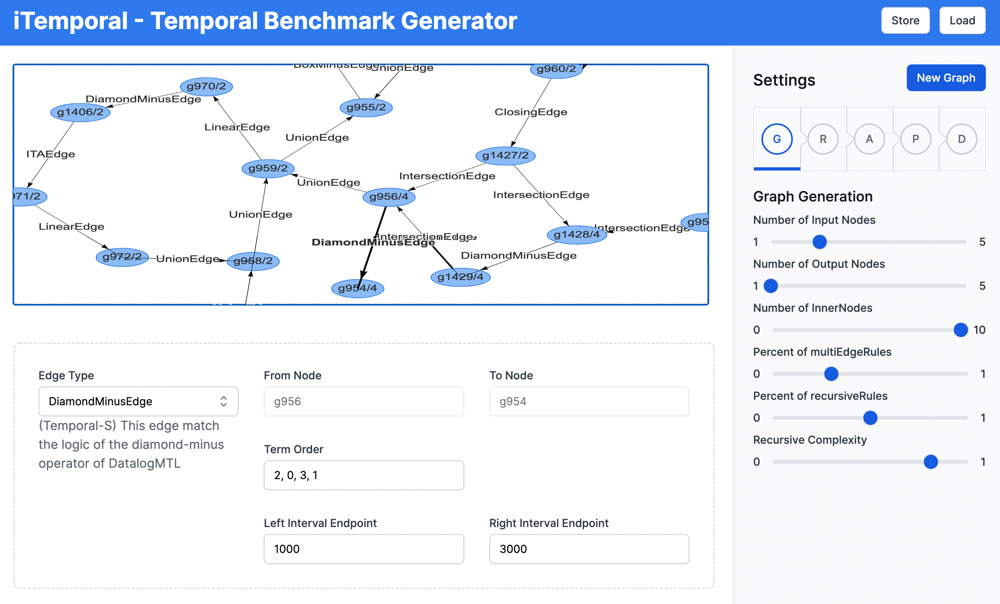

# iTemporal Frontend

This is an optional frontend for the benchmark generator.

You can run `npm start` to run the app in the development mode.\
Open [http://localhost:3000](http://localhost:3000) to view it in your browser.

The page will reload when you make changes.\
You may also see any lint errors in the console.

